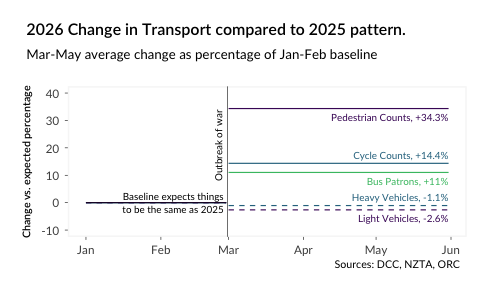
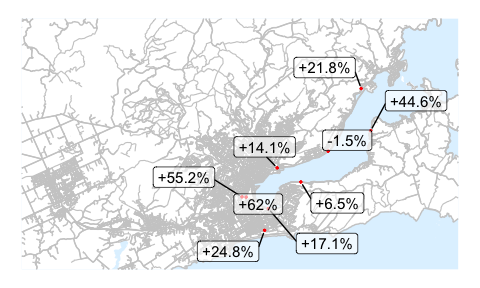

# War, fuel, and transport changes
David Hood, david@thoughtful.net.nz
2026-07-05

- [1
  Introduction](#introduction)
  - [1.1 Acknowledgements and
    sources](#acknowledgements-and-sources)
  - [1.2 The key
    calculation](#the-key-calculation)
  - [1.3 No conflicts of
    interest](#no-conflicts-of-interest)
- [2 Fuel
  prices](#fuel-prices-1)
- [3 2023 Census
  background](#2023-census-background)
  - [3.1 Graphs](#graphs)
  - [3.2 Transport
    Modes](#transport-modes)
  - [3.3 Work/Study from
    Home](#workstudy-from-home)
  - [3.4 Car use](#car-use)
  - [3.5 Bus use](#bus-use)
  - [3.6 Cycle use](#cycle-use)
  - [3.7 Walking](#walking)
- [4 Light vehicle (car)
  changes](#light-vehicle-car-changes)
- [5 Heavy vehicle (truck)
  changes](#heavy-vehicle-truck-changes)
- [6 Bus passenger
  changes](#bus-passenger-changes)
- [7 Cycle count
  changes](#cycle-count-changes)
- [8 Pedestrian counter
  changes](#pedestrian-counter-changes)
- [9 Overall
  comments](#overall-comments)

Compared to the same time last year, among traffic evidence for
Ōtepoti/Dunedin:

- Fuel is up (Regular Petrol +28%, Diesel +74%)

- Vehicle traffic counts are down (Light -2.6%, Heavy -1.1%)

- Bus patronage is up 11%

- Cycle traffic counts are up 14.4%

- Pedestrian traffic counts are up 34.3%



# Introduction

As I, as a pedestrian in Ōtepoti/Dunedin, have been making my way to
work, I have been remarking to other pedestrians that “there seem to be
a big change in the number of people you see on the street”.

Being a data person, I wanted to bring together all the data I could for
an overview. This is it.

The analysis was carried out in R, with all analysis code available in
the GitHub repo of:

https://github.com/thoughtfulbloke/Fuel_report

All graphs in this document are available individually there in the
Figures_standalone folder.

The Code is MIT licenced, so basically it is fine for anyone to draw
from. But while the data is open, I thought you should go back to the
original sources, as it is being provided by others.

## Acknowledgements and sources

This is all based on public available or requestable data

### Fuel prices

Fuel price data is based on the national New Zealand average board
prices in the MBIE weekly fuel price monitoring data.

https://www.mbie.govt.nz/building-and-energy/energy-and-natural-resources/energy-statistics-and-modelling/energy-statistics/weekly-fuel-price-monitoring

### Food prices

Food prices are based on the Stats NZ food price index, available as
part of Stats NZ selected prices.

https://www.stats.govt.nz/information-releases/selected-price-indexes-may-2026/

Though available as a Selected Prices csv at:

https://www.stats.govt.nz/large-datasets/csv-files-for-download/

### Census Travel Data

2023 census data on travel to work or study by SA2 area is from the
Aotearoa Data Explorer

https://explore.data.stats.govt.nz

### Map visualisation data

The SA2 geographic boundaries used in visualising census maps are via
the Stats NZ Geographic Data Service

https://catalogue.data.govt.nz/dataset/statistical-area-2-2023-clipped-generalised

https://datafinder.stats.govt.nz/layer/111206-statistical-area-2-2023-clipped-generalised/

The underlying geographic features for the Dunedin area were downloaded
from OpenStreetMap

https://www.openstreetmap.org

However, I supplemented the OpenStreetMap data with the Land Information
New Zealand roads data file to show main roads

https://data.linz.govt.nz/layer/50329-nz-road-centrelines-topo-150k/

### Vehicle data

Vehicle counter data, both for light (car) and heavy (truck) is from
NZTA Open Data

https://opendata-nzta.opendata.arcgis.com/datasets/898e77d403c443c4961ada073d144735_0/explore

Traffic Counter Locations is also from NZTA Open Data

https://opendata-nzta.opendata.arcgis.com/datasets/b90f8908910f44a493c6501c3565ed2d_0

### Bus patronage

Data on daily numbers boarding buses, by route of bus, is courtesy of a
request to the Otago Regional Council.

### Cycle counts and pedestrian counts

While these are managed by both NZTA and the Dunedin City Council, data
is publicly available from the Dunedin City Council at

https://www.dunedin.govt.nz/community-facilities/cycling/cycle-counter-dashboard

I am using the data contained in this dashboard in a more convenient
spreadsheet, courtesy of a request to the Dunedin Regional Council.

## The key calculation

The calculation being used is change in daily average transport use
since before the war, in relation to the annual pattern of last year.

If the daily average of March to May 2025 is 10% below the daily average
of January to February 2025, and the daily average of March to May 2026
is 2% above the daily average of January to February 2026, then we are
describing 2026 traffic as being 12% (2% - -10%) higher than expected.

For the headline numbers, the is the daily average across the entire
March to May period, so this incorporates the full April Holiday
periods, even though they were in different times in April it all
balances out.

Traffic changes didn’t necessarily begin at the immediate outbreak of
war, as it took a few weeks for fuel price changes to flow through, but
it makes a convenient common point for before/after comparisons. The
changes for the time since the mode changed are slightly more extreme if
the period of continued normalcy is excluded.

The detailed individual mode summaries include things like seven day
rolling averages, where care should be used if directly comparing to the
same time in 2025, as in year events like Easter take place at different
times.

To make shorter term calculations, I shifted the date of 2025 days by 1
day to match the 2025 and 2026 day of the week. So, for example, Monday
March 17th 2025 is being matched to Monday March 16th 2026.

Where traffic counters are being aggregated I have chosen to use the
daily average of the sum of the counters for counters available through
the period, rather than an average across all counters. I checked both
ways of aggregating and found that, in practice, it didn’t change the
overall outcomes.

## No conflicts of interest

This is a personal project of understanding, I have no financial or
other connections with any transport related entities. I occasionally
drive a car to support others, and walk to and from work.



# Fuel prices

National fuel board prices suggest people using diesel or petrol have
been paying between \$0.70 and \$1.50 more a litre for fuel (depending
on fuel type). This price has been largely stable for March to May,
creating ongoing household costs. With the way fuel is incorporated into
things like food productions, people expect there will still be cost of
living pressures long after any future drop in fuel prices.

Food inputs such has fertiliser (which require fossil fuels) have months
of lag time before price changes are fully worked through. And Food is
not a flattening price trend at the present.



# 2023 Census background

The 2026 transport data measures a range of things. Vehicle traffic
counters measure the traffic at counter locations in the course of
journeys. Cycle and pedestrian counters measure their own kinds of
traffic at different locations. Bus boarding data measures people
getting on buses starting their journey on that bus.

All of these can be used to measure change in transport mode usage over
time. The degree of change can be compared between different modes. But
the data does not uniformly directly translate to a number of people
figure.

For a baseline, the 2023 census, via the Stats NZ Aotearoa data
explorer, has main method of journey to work or study based on SA2
statistical areas. This is both from the perspective of the method by
which people living in a SA2 area travelled to work/education, and for
businesses and educational institutions in a SA2 area had people travel
to them.

## Graphs

For each combination of main mode of travel, I am making 8 graphs so
they are available for anyone interested

1)  Percentage of each SA2 using the mode of travel to work- this is an
    indicator of how important the mode was to that part of the city in
    2023 for the obligate task of getting to work.

2)  Raw number of each SA2 using the mode of travel to work- this is an
    indicator of where a lot of people using that mode are living. A
    wider measure for the city.

3)  Percentage of each SA2 using the mode of travel to education- this
    is an indicator of how important the mode was to that part of the
    city in 2023 for the obligate task of getting to study.

4)  Raw number of each SA2 using the mode of travel to study- this is an
    indicator of where a lot of people using that mode are living. A
    wider measure for the city of those studying.

5)  Percentage of people employed by a business with an address in a SA2
    using a mode of travel to work- the opposite end of the trip from
    home, and home import are different means of getting people there.

6)  Raw number of people employed by a business with an address in a SA2
    using a mode of travel to work- the day parking issue for those
    driving, but more generally a destination focus

7)  Percentage of people studying at an educational institute with an
    address in a SA2 using a mode of travel to work- how students are
    arriving at the place where they learn. The importance of modes to
    the institutions of that SA2 area.

8)  Raw number of people studying at an educational institute with an
    address in a SA2 using a mode of travel to work- The size of the
    student movements around town.

## Transport Modes

Working and Studying from home is a slightly different mode to others.
Those doing so do need transport at other times, but do not need it as
part of the obligate work/study commute. But we have no knowledge of how
they are commuting at other times.

Because they reflect the total people in the area, the percentages per
SA2 statistical area for work from home is as a percentage of the total
people who responded to the question. Other forms of travel are as a
percent of the total people in movement - the percentage of travellers,
rather than the percentage working or studying.

The colour range of the individual visualisations, from very dark blue
(low) to light green (high) are for the number range of that map, so
colours are not directly comparable between maps.

## Work/Study from Home

Working or studying from home is being provided for illustrative
purposes. The rates do not directly equate to working or studying in the
Dunedin area, as working from home can be living at one’s rural
workplace, basing one’s workplace in one’s home, working remotely to
anywhere, or studying to anywhere.

Similarly, for organisations with people working/studying from home,
those people can be far distant. But it does reflect earning an income
or studying without the requirement for travel, which I think is a
useful thing to keep in mind about affected people.

### For homes in the SA2 areas

For most of the city SA2 areas, those residents of an area working from
home are in the 9-16% range.

Much of the SA2 areas in the city have 50 to 200 workers who are working
from their residences. About 8000 workers in SA2 areas appearing on the
map are working from home.

Outside of the area most tertiary students live, and some live in
hostels, the percentage of people studying from home is in the 5-10%
range.

The specific location of student hostels can have a profound effect on
the raw numbers of studying from one’s residence (or residing in one’s
study), but most SA2 areas have been 30 and 60 residents studying from
home. Over the visualised area, about 2200 students were studying from
home.

### For workplaces & educational institutions in the SA2 areas

Among workplaces headquartered in SA2 areas, the percentage of workers
working from home (both living at the workplace and working remotely) is
very patchwork. But for businesses in the central city it is very low,
and rural areas it is high.

The number of employees of businesses working from home ranges from
under 50 in coastal main city SA2 areas, to 100-200 in the rural outer
parts of the city. Overall the number of residents working from home is
very close to the number of working from home workers in workplaces,
suggesting remote work is either negligible or cancels out in in/out
remoteness from the study area.

SA2 blocks where the only educational institution present is residential
can contain very, very study high from home percentages. But for most of
the city with more educational places is below 20%.

Educational Locations with residential students tend to be boarding
schools (large numbers in a SA2) or homeschools (normally low numbers in
a SA2). As with workers, the Study from Home by location of educational
institute is very similar to students studying from home.

## Car use

Driving (and being a driver’s passenger) for obligate times reflects
both driving required to earn a living and driving at peak (least
efficient journey) times.

### For homes in the SA2 areas

The general pattern, among those working but not working from home, is
the further out of town you live, the more likely you are to be using a
car. A minority in the central city, and a near totality of commuting
workers who live in the outer rural edges of the city.

For the raw numbers of car travelling workers, many are driving from
newer satellite suburbs. Close to 45,000 workers were drivers or
passengers.

Students going to study reflects a similar core/periphery relationship
to those travelling to work. Though the extremes of driving and being
driven are not as great as with work.

In the very geographically similar to driving to work map, students are
slightly more than a third of car commuters at nearly 16,000.

### For workplaces & educational institutions in the SA2 areas

Among workplaces headquartered in SA2 areas, the percentage of workers
arriving via car is at their lowest in the tertiary area of the city.

In raw numbers rather than percentages, businesses in the central city
have the most workers arriving by car.

There are some subtleties around where students are coming from, and
what kind of educational places are in that area, in the percentage of
students are arriving by car.

The raw number figures have a very different distribution. to the
percentages because the total pool of students attending institutions in
different SA2 areas are of very different sizes.

## Bus use

For workers this is transport via a public bus. For students this is
transport either by public bus or school bus.

### For homes in the SA2 areas

Unsurprisingly given routes, there is an inland rural vs coastal urban
divide on using the bus to get to work.

For the raw numbers of bussing workers, it is pretty similar to the
percentages as a pattern. About 3,000 workers caught the bus in the
census.

The differences between workers going to work and students going to
study shows the importance of some school bus routes.

Hot spots which are not hotspots in the percentage map are areas where a
lot of people of education-busing age are living. Nearly 3,200 students
are busing to school in the census.

### For workplaces & educational institutions in the SA2 areas

As well as the inner central city, the Andersons Bay/ Bayfield area has
a high level of workers arriving by bus.

In raw numbers, it is very clear that regardless of where workers are
coming from, they are bussing to employers in the inner city and
tertiary area.

In general, areas containing high schools have higher levels of students
arriving by bus. Which is not too surprising about the nature of
bussing.

The raw number figures are again a very different distribution to the
percentages, again because the total pool of students attending
institutions in different SA2 areas are of very different sizes.

## Cycle use

The Ōtepoti/Dunedin cycle network has expanded since 2023. While the
change between 2025 and 2026 can be treated as comparable, the 2023
census figures should be treated as a lower bound. There have also been
major changes in e-bike availability which may have disrupted the
relationship between flatness and cycling. This may have particularly
effected the non-flat SA2 areas.

### For homes in the SA2 areas

Cycling to work in 2023 was mainly from near inner Dunedin flat areas.

For the raw numbers of cycling workers, routes from the Southern and
Peninsula coast become more important when looking at total numbers
(about 1,700) of cyclists commuting to work.

Students cycling are a bit more pervasive than adults cycling to work in
Mosgiel, likely reflecting distance to destination.

The North East Valley, Mosgiel, and St. Kilda are strongly contributing
to the total number of cycling students (a little over 1000).

### For workplaces & educational institutions in the SA2 areas

Workplaces in Portobello show up with a high proportion of cyclist
workers.

The core inner city has a high number of cyclist workers, though it was
a low percentage of the total number of workers.

For cycling to education, Mosgiel shows up as an “island” of local
cycling separate from the rest of the city.

The raw number of cyclists are arriving to the tertiary area, and some
in Mosgiel.

## Walking

### For homes in the SA2 areas

Walking to work is the inverse of driving. Highest in the core inner
city.

The raw numbers (about 5800 in total) and percentages have a very
similar range.

Students walking is strongly affected by the tertiary region.

Again the tertiary area creates a long shadow of the total (around
15,000) walking students.

### For workplaces & educational institutions in the SA2 areas

Outside of the central and rural areas, workplaces for most of the city
are in 6-12% of employees working.

The core inner city has a high number of walking workers, though it was
a medium percentage of the total (large) number of workers.

Educational locations in upper North East Valley have a near 100%
students arriving by walking.

The raw number of walkers are arriving to the tertiary area swamps all
others by a massive amount. While there are more than a dozen SA2 areas
where educational institutions have hundreds walking to school, the
tertiary area has around 11,000.



# Light vehicle (car) changes

NZTA traffic count stations record the number of cars passing that
station per day. So daily aggregation of the stations can either be a
total across the network, an average across stations, or a more complex
geographic imputation.

I tested both totalling and averaging, and found it didn’t make much
difference to the trend so chose to total. But this is all to make it
clear we are counting sightings across observer stations not trips.

The number of stations that I could use increased if I could include
those missing a few days. As a ‘balancing the data’ response for
incorporating those with missing entries I removed the entries for those
days from all used counters. This means the rolling 7 day aggregates are
sometimes 6 days.

Individual counter traffic can be affected by things like road works and
diversions as well a short term missing data. That is something to keep
in mind when reviewing individual counters- changes can be the result of
very local factors as well the general response of traffic at those
counters to global actions.

The commonest drops in light vehicle counts are for 3-4% in the March to
May period. If this equated directly to the number of people in the
census it would be around 1,800 fewer car commuters, but counters have
no way of detecting fullness of vehicles- car pooling consolidating into
fewer cars and similar.

It took around 2 weeks for traffic to consistently move from being above
2025 levels to being below. Fuel prices by then were well above
historical levels, but had not yet peaked.

I don’t think too much should be read into details like the 2025 holiday
minima being lower- we don’t have enough data to indicate if it is
something like more people left town by driving.

Checking the “by weekday” changes, it looks a lot like the changes in
vehicle use are influenced by weekly cycles of life. Traffic is down
Monday and Wednesday, with possible consolidation days following of less
down or up traffic counts.



# Heavy vehicle (truck) changes

Most of the discussion and caveats in the light vehicle counter
sections. However, heavy vehicle use is more likely to be work only
vehicles after the driver has commuted by other means, making the census
background less relevant.

Heavy vehicles are also more likely to be fuelled by diesel, which saw
much larger price rises in relation to its base price than petrol.

Finally, while heavy vehicle counters can (like light) be influenced by
road works and diversions, that can also be influenced by construction
works across a period providing a temporary destination for vehicles.

While the number of heavy vehicles counted in the two central city sites
has increased, it is down through the rest of the counter network.

As heavy vehicle use was noticeably higher in the early part of 2026
than 2025, it is harder to recognise the March-May decrease by eye when
it is still at similar levels to 2025. But, like light vehicles, a
couple of weeks after the outbreak of war sees a change.

The weekly pattern changes for heavy vehicles has a similar low Monday
and lower Wednesday pattern to light vehicle counts. Sunday and Friday
differ to light vehicles.



# Bus passenger changes

Unlike traffic counter data, bus patronage data is a direct measure of
people- it is people boarding buses in the network and tagging on
(including transfers).

I haven’t had time to unpick individual changes to routes that might
have effected route specific use, but we can broadly say that the
changes in the individual routes is consistent with a spread around the
11% higher use of the total network. This to me suggests it is a general
change.

The year began with passenger boarding numbers notably down on last
year, associated with trade-offs in changes in fare structure. About a
week after the outbreak of war, passenger numbers rose. This rise to
levels equal to or above last year has remained for the full period.

Bus changes are at their lowest on Wednesday and Monday, which mirrors
both Light and Heavy Vehicles. Other weekdays have notably rises.



# Cycle count changes

As counter data, the cycle count data is similar to vehicle count data.
It has similar issues around road works etc affecting individual counter
results.

Many of the individual cycle counters around town are up from between
15% and 25%. Another set of peripheral sites are in the 0-9% range. A
few outliers have other readings.

The year began with noticeably lower total daily cycle counts, which
(like bussing) a week after the war outbreak rose to levels the same or
above 2025 based expectations.

As with vehicles or buses, cyclists are lower on a Wednesday, and Monday
has the second lowest growth compared to expectations. This does seem to
be a general trend in degree of movement, rather than just the means of
movement.



# Pedestrian counter changes

Pedestrian counters are also available from the Dunedin City Council,
though there are fewer of them than cycle counters.

Pedestrian counts started the year well under 2025 levels, but a week
after war broke out rose to consistently exceed 2025.

There is a very high baseline of growth in walkers above expected rates,
but within that Wednesday is the lowest growth, and Monday the second
lowest (like other modes of transport). Unlike other modes, weekend
growth is very similar to weekday growth, which may say something about
the kind of people walking more.



# Overall comments

There is a general mode shift away from cars and towards other
transport. As there is a baseline of more car use, small percentage
drops in personal vehicle use are associate with large percentage
increases of their baselines in other modes of transport.

But it is not just mode shift. Checking the days of the week suggests
less travel across all modes on (particularly) Wednesday and (less so)
Monday. This does look a lot like what you would see if there was more
work from home taking place.
